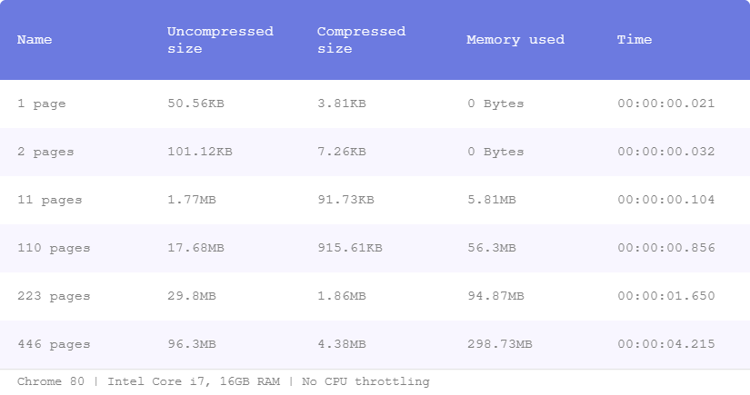
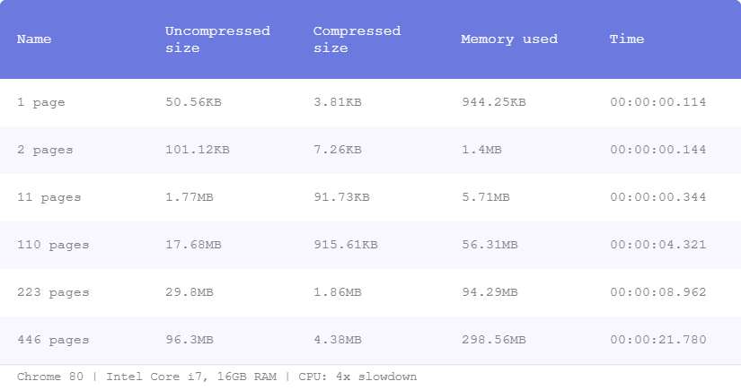
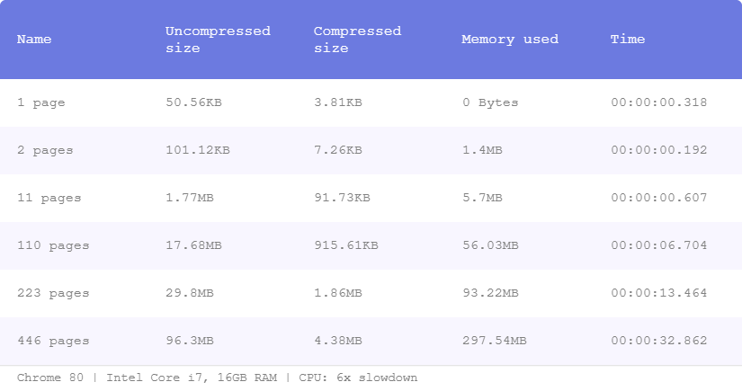
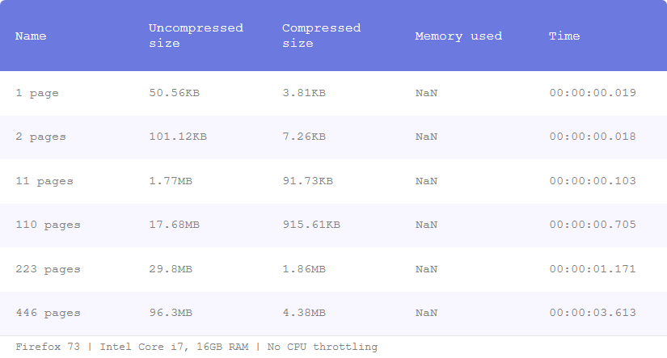
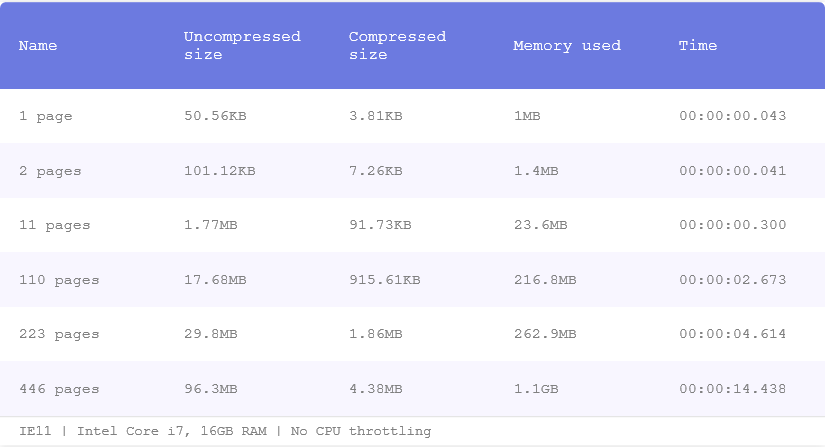

# JSZip library benchmarking
This project benchmarks the [jszip](https://stuk.github.io/jszip/) library to see how it behaves when decompressing archived files used by Validation Station when integrating with Orchestrator.

We are testing 6 different *.zip* files, more specifically the DOM json resulted from the digitization of different documents with different number of pages: 1, 2, 11, 110, 223 and 446 pages.

2 key metrics are being evaluated:
- memory usage
- time

# Results

- In modern browsers the lib works pretty well, with very decent memory consumption and pretty fast. Both metrics have a linear growth.
- In modern browsers, **with CPU throttling**, the memory consumtion stays at the same level but the time grows pretty much for big documents (it took ~32sec to unzip the 446 pages file with 6x CPU throttling).
- IE11 works very well for small documents and I think it's pretty decent for big documents: took ~14sec to unzip the 446 pages file. It's pretty much the equivalent of throttling Chrome with 2x.
- Firefox is slightly faster than Chrome

## Chrome

  
  

  

  
  

  

  

## Firefox

## IE

